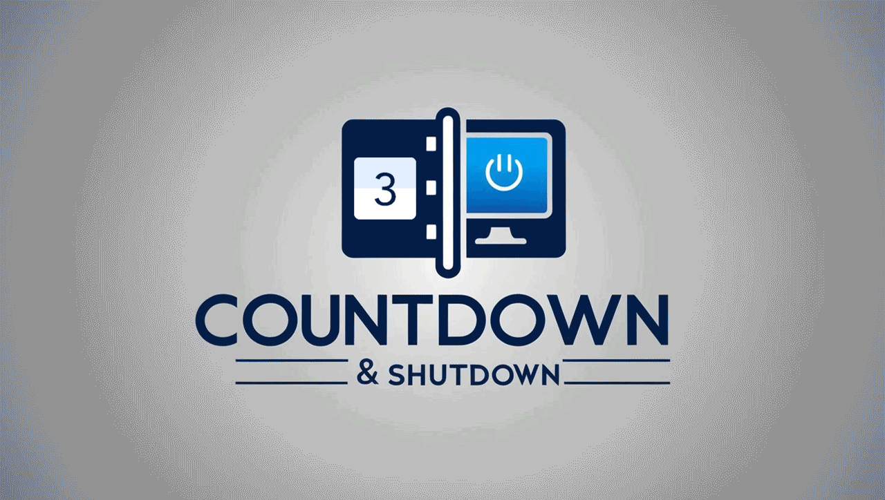
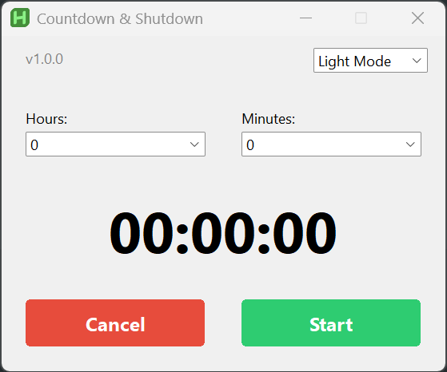
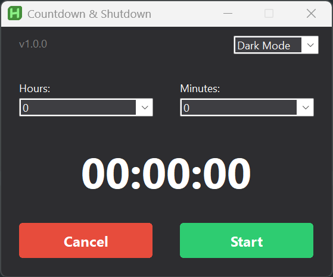

# Countdown & Shutdown

> ⚠️ **Important Note about Browser/Antivirus Warnings**  
> 
> If your browser or antivirus flags **Countdown & Shutdown** as "unsafe," **do not worry** — this is a **false positive**.  
> Browsers and antivirus software rely heavily on generic online databases without actually analyzing what a program does.  
> Unfortunately, this often results in safe, small independent projects being incorrectly flagged.  

- **Countdown & Shutdown** is a lightweight and handy tool designed to automatically shut down your computer after a set period of time — up to 48 hours. It’s especially useful when you're at home or in the office and need to leave your computer running to finish tasks like downloading large files, rendering, or processing data that can't be interrupted.

  Instead of waiting for your system to finish, you can simply schedule an automatic shutdown and leave with peace of mind, knowing your computer will power off safely based on your selected timer settings.

  

  

  

  ### 🧰 Key Features

  - 🕒 Schedule shutdowns up to 48 hours in advance

  - 🌗 Switch between **Dark** and **Light** themes via a simple dropdown menu

  - ⏱️ Intuitive interface with dropdown lists to select hours and minutes

  - ✅ Two main buttons:  
    - **Start** to begin the countdown  
    - **Cancel** to stop the shutdown timer at any time
    
  - 🔄 Automatically checks for updates at every launch — if a newer version is available, you'll be notified and given the option to download it directly to your preferred location

  - 📁 **No installation required** — the program is fully portable. Just place it anywhere and run it.

    

---

## Donation
If you enjoy using this software and find it helpful and you have the possibility, please consider making a small donation to support the ongoing development of this and other projects. Your generosity is greatly appreciated!
PayPal:

Ko-fi:

